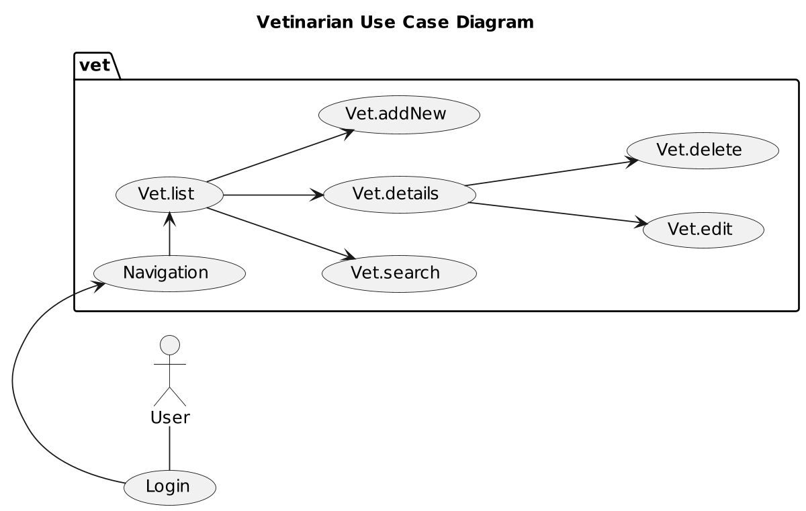
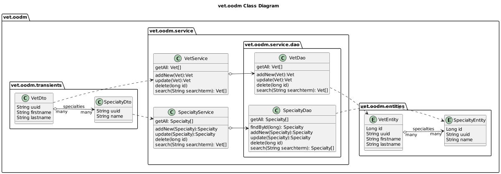
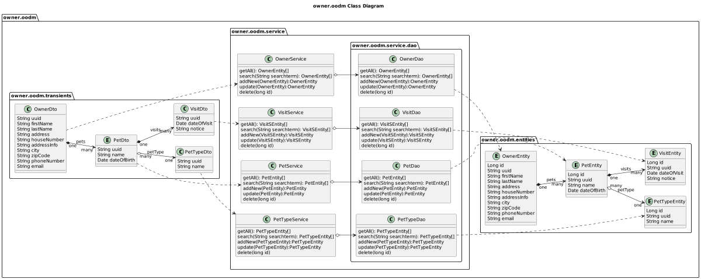

# petclinic-jakartaee


Petclinic Jakarta EE - a Jakarta EE 10 Version of Spring Petclinic demo application using PrimeFaces JSF.


## What is this?
* JSF and Jakarta EE 10 Version of [Spring Petclinic](https://github.com/spring-projects/spring-petclinic)
* This is an Update of [Java EE 7 Petclinic](https://jakarta-ee-petclinic.github.io/petclinic-javaee7/)

## Where is it?
* Github: [https://github.com/Jakarta-EE-Petclinic/petclinic-jakartaee](https://github.com/Jakarta-EE-Petclinic/petclinic-jakartaee)
* Demo on OpenShift: [http://jakartaee8petclinic.rhcloud.com/](http://jakartaee8petclinic.rhcloud.com)
* Blog: [https://thomas-woehlke.blogspot.com/2014/02/java-ee-7-petclinic.html](https://thomas-woehlke.blogspot.com/2014/02/java-ee-7-petclinic.html)

## Motivation
* Some experimental Work with JSF, Jakarta EE 10 and Java EE 
* This Demo Application is planned to be the first in a series of “Rosetta Stone” to compare OOP Web Application Frameworks

## Why Petclinic?
* The Domain Classes show all relationships like one-to-many (1:n), many-to-one (n:1) and many-to-many (n:m)
* It is simple enough but yet it shows more than just the CRUD Use Cases (Create, Read, Update, Delete) of most Demos and Training Examples.
* You can think of it as smallest complete Web App with the usual things to solve.

## About Java EE 7 Petclinic
* [github.com/Jakarta-EE-Petclinic/petclinic-javaee7](https://github.com/Jakarta-EE-Petclinic/petclinic-javaee7)
* [Thomas Woehlke: Java EE 7 Petclinic](https://thomas-woehlke.blogspot.com/2014/02/java-ee-7-petclinic.html)
* [Stefan Hildebrandt: Was eine QS-Abetilung immer wollte. Mit automatisierten Tests zum Ziel](https://consulting.hildebrandt.tk/vortraege/integrierteAkzeptanztests/slides/index.html#/)
* [Reza Rahman: Migrating the Spring Pet Clinic to Java EE 7](https://dzone.com/articles/migrating-spring-pet-clinic)

### Spring Petclinic
* Github: [https://github.com/spring-projects/spring-petclinic](https://github.com/spring-projects/spring-petclinic)

## dev, build ...

```
git clone git@github.com:Jakarta-EE-Petclinic/petclinic-jakartaee.git
cd petclinic-jakartaee
./mvnw
```

## ... deploy and run

| maven profile      | Runtime                                                               | Version      | Status         |
|--------------------|-----------------------------------------------------------------------|--------------|----------------|
| ./mvnw -Pliberty   | [OpenLiberty](https://openliberty.io/)                                | 23.0.0.6     | Jakarta EE 10  |
| ./mvnw -Pwildfly   | [Wildfly](https://www.wildfly.org/)                                   | 28.0.1.Final | Jakarta EE 10  |
| ./mvnw -Ppayara    | [Payara](https://www.payara.fish/products/payara-platform-community/) | 6.2023.6     | Jakarta EE 10  | 
| ./mvnw -Pglassfish | [GlassFish](https://glassfish.org/)                                   | 7.0.5        | Jakarta EE 10  |
| ./mvnw -Ptomee     | [Apache TomEE](https://tomee.apache.org/)                             | 9.1.0        | Jakarta EE 9.1 |


## Integration Tests

Arquillian End2End Tests for REST Endpoints and for JSF Frontend Browser Tests with Graphene and Selenium.
* [JSF, Java Server Faces: Primefaces 12.0.0](https://www.primefaces.org/)

| maven profile                  | Runtime                                                                  | Version      | Status                  |
|--------------------------------|--------------------------------------------------------------------------|--------------|-------------------------|
| ./mvnw -Parq-liberty-managed   | [OpenLiberty](https://openliberty.io/docs/latest/overview.html)          | 23.0.0.1     | waiting for OpenLiberty |
| ./mvnw -Parq-wildfly-managed   | [Wildfly](https://docs.wildfly.org/27/)                                  | 27.0.1.Final | work in progress        |
| ./mvnw -Parq-payara-managed    | [Payara](https://docs.payara.fish/community/docs/6.2022.1/Overview.html) | 6.2023.2     | work in progress        | 
| ./mvnw -Parq-glassfish-managed | [GlassFish](https://glassfish.org/documentation)                         | 7.0.2        | work in progress        |

## Petclinic - Functional Requirements

Object Oriented Design

## Petclinic Overview

### Petclinic Domain Class Modell


### Petclinic Use Case Diagram


## Application

## Vet and Specialty

### Specialty

#### Specialty Use Case Diagram


#### Specialty Use Case and State Table

| Specialty Use Cases | Specialty States             | Frontend                                |
|---------------------|------------------------------|-----------------------------------------|
| Specialty.list      | SPECIALTY_LIST_EMPTY         | Disable Search-Button and Paging-Widget |
| Specialty.list      | SPECIALTY_LIST               |                                         |
| Specialty.search    | SPECIALTY_LIST_SEARCH_RESULT |                                         |
| Specialty.addNew    | SPECIALTY_NEW                |                                         |
| Specialty.details   | SPECIALTY_DETAILS            |                                         |
| Specialty.edit      | SPECIALTY_EDIT               |                                         |
| Specialty.delete    | SPECIALTY_DELETE             |                                         | 


#### Specialty State Diagram


#### Specialty State Table

| PetType Use Cases   | Actions                                  | Frontend to View                               | View to Backend (DB) | outcome             | precondition                        | postcondition                                  |
|---------------------|------------------------------------------|------------------------------------------------|----------------------|---------------------|-------------------------------------|------------------------------------------------|
| Specialty.list      | SpecialtyView.button_list_dialog()       | x, calls: SpecialtyView.loadList()             |                      | change state        | length(list(Specialty)) > 0         | SPECIALTY_LIST                                 |
| Specialty.list      | SpecialtyView.loadList()                 |                                                | x                    | list(Specialty)     | length(list(Specialty)) == 0        | SPECIALTY_LIST_EMPTY                           |
| Specialty.list      | SpecialtyView.loadList()                 |                                                | x                    | list(Specialty)     | length(list(Specialty)) > 0         | SPECIALTY_LIST                                 |
| Specialty.addNew    | SpecialtyView.button_addNew_dialog()     | x                                              |                      | change state        | SPECIALTY_LIST                      | SPECIALTY_NEW                                  |
| Specialty.addNew    | SpecialtyView.cancelNew()                | x                                              |                      | change state        | SPECIALTY_NEW                       | SPECIALTY_LIST                                 |
| Specialty.addNew    | SpecialtyView.saveNew()                  | x, calls: SpecialtyView.saveNewEntity()        |                      | if OK: change state | SPECIALTY_NEW                       | SPECIALTY_DETAILS                              |
| Specialty.addNew    | SpecialtyView.saveNewEntity()            |                                                | x                    | OK                  | length(list(Specialty)) = n         | length(list(Specialty)) = n+1                  |
| Specialty.addNew    | SpecialtyView.saveNewEntity()            |                                                | x                    | not OK, invalid     | length(list(Specialty)) = n         | display cause as flash message                 |
| Specialty.details   | SpecialtyView.showDetailsForm(Specialty) | x                                              |                      | change state        | SPECIALTY_LIST                      | SPECIALTY_DETAILS                              |
| Specialty.edit      | SpecialtyView.showEditForm()             | x                                              |                      | change state        | SPECIALTY_DETAILS                   | SPECIALTY_EDIT                                 |
| Specialty.edit      | SpecialtyView.cancelEdited()             | x                                              |                      | change state        | SPECIALTY_EDIT                      | SPECIALTY_LIST                                 |
| Specialty.edit      | SpecialtyView.saveEdited()               | x, calls: SpecialtyView.saveEditedEntity()     |                      | if OK: change state | SPECIALTY_EDIT                      | SPECIALTY_DETAILS                              |
| Specialty.edit      | SpecialtyView.saveEditedEntity()         |                                                | x                    | OK                  | length(list(Specialty)) = n > 0     | length(list(Specialty)) = n; 1 element changed |
| Specialty.edit      | SpecialtyView.saveEditedEntity()         |                                                | x                    | not OK, invalid     | length(list(Specialty)) = n >= 0    | display cause as flash message                 |
| Specialty.delete    | SpecialtyView.showDeleteForm()           | x                                              |                      | change state        | SPECIALTY_DETAILS                   | SPECIALTY_DELETE                               |
| Specialty.delete    | SpecialtyView.cancelDelete()             | x                                              |                      | change state        | SPECIALTY_DELETE                    | SPECIALTY_LIST                                 |
| Specialty.delete    | SpecialtyView.performDelete()            | x, calls: SpecialtyView.deleteSelectedEntity() |                      | if OK: change state | SPECIALTY_DELETE                    | SPECIALTY_DETAILS                              |
| Specialty.delete    | SpecialtyView.deleteSelectedEntity()     |                                                | x                    | OK                  | length(list(Specialty)) = n > 0     | length(list(Specialty)) = n-1                  |
| Specialty.delete    | SpecialtyView.deleteSelectedEntity()     |                                                | x                    | not OK, invalid     | length(list(Specialty)) = n >= 0    | display cause as flash message                 |


### Vet

#### Vet Use Case Diagram



#### Vet Use Case and State Table

| Use Case     | Vetinarian States       | Frontend                                |
|--------------|-------------------------|-----------------------------------------|
| Vet.list     | VET_LIST_EMPTY          | Disable Search-Button and Paging-Widget |
| Vet.list     | VET_LIST                |                                         |
| Vet.search   | VET_LIST_SEARCH_RESULT  |                                         |
| Vet.addNew   | VET_NEW                 |                                         |
| Vet.details  | vet_DETAILS             |                                         |
| Vet.details  | VET_DETAILS             |                                         |
| Vet.edit     | VET_EDIT                |                                         |
| Vet.delete   | VET_DELETE              |                                         |   

*) TODO

#### Vet State Diagram


#### Vet State Table

| PetType Use Cases | Actions                        | Frontend to View                         | View to Backend (DB) | outcome             | precondition                 | postcondition                            |
|-------------------|--------------------------------|------------------------------------------|----------------------|---------------------|------------------------------|------------------------------------------|
| Vet.list          | VetView.button_list_dialog()   | x, calls: Vet View.loadList()            |                      | change state        | length(list(Vet)) > 0        | VET_LIST                                 |
| Vet.list          | VetView.loadList()             |                                          | x                    | list(Vet)           | length(list(Vet)) == 0       | VET_LIST_EMPTY                           |
| Vet.list          | VetView.loadList()             |                                          | x                    | list(Vet)           | length(list(Vet)) > 0        | VET_LIST                                 |
| Vet.addNew        | VetView.showNewForm()          | x, calls: VetView.newEntity()            |                      | change state        | VET_LIST                     | VET_NEW                                  |
| Vet.addNew        | VetView.cancelNew()            | x                                        |                      | change state        | VET_NEW                      | VET_LIST                                 |
| Vet.addNew        | VetView.saveNew()              | x, calls: VetView.saveNewEntity()        |                      | if OK: change state | VET_NEW                      | VET_DETAILS                              |
| Vet.addNew        | VetView.saveNewEntity()        |                                          | x                    | OK                  | length(list(Vet)) = n        | length(list(Vet)) = n+1                  |
| Vet.addNew        | VetView.saveNewEntity()        |                                          | x                    | not OK, invalid     | length(list(Vet)) = n        | display cause as flash message           |
| Vet.details       | VetView.showDetailsForm(Vet)   | x                                        |                      | change state        | VET_LIST                     | VET_DETAILS                              |
| Vet.details       | VetView.cancelDetails()        | x                                        |                      | change state        | VET_DETAILS                  | VET_LIST                                 |
| Vet.edit          | VetView.showEditForm()         | x                                        |                      | change state        | VET_DETAILS                  | VET_EDIT                                 |
| Vet.edit          | VetView.cancelEdited()         | x                                        |                      | change state        | VET_EDIT                     | VET_LIST                                 |
| Vet.edit          | VetView.saveEdited()           | x, calls: VetView.saveEditedEntity()     |                      | if OK: change state | VET_EDIT                     | VET_DETAILS                              |
| Vet.edit          | VetView.saveEditedEntity()     |                                          | x                    | OK                  | length(list(Vet)) = n > 0    | length(list(Vet)) = n; 1 element changed |
| Vet.edit          | VetView.saveEditedEntity()     |                                          | x                    | not OK, invalid     | length(list(Vet)) = n >= 0   | display cause as flash message           |
| Vet.delete        | VetView.showDeleteForm()       | x                                        |                      | change state        | VET_DETAILS                  | VET_DELETE                               |
| Vet.delete        | VetView.cancelDelete()         | x                                        |                      | change state        | VET_DELETE                   | VET_LIST                                 |
| Vet.delete        | VetView.performDelete()        | x, calls: VetView.deleteSelectedEntity() |                      | if OK: change state | VET_DELETE                   | VET_DETAILS                              |
| Vet.delete        | VetView.deleteSelectedEntity() |                                          | x                    | OK                  | length(list(Vet)) = n > 0    | length(list(Vet)) = n-1                  |
| Vet.delete        | VetView.deleteSelectedEntity() |                                          | x                    | not OK, invalid     | length(list(Vet)) = n >= 0   | display cause as flash message           |

### VetView and SpecialtyView Class Diagram


### Specialty and Vet DB Backend: vet.oodm




## Owner and PetType

### PetType

#### PetType Use Case Diagram


#### PetType Use Cases and States Table

| PetType States   | PetType Use Cases          | Frontend                                 |
|------------------|----------------------------|------------------------------------------|
| PetType.list     | PETTYPE_LIST_EMPTY         | Disable Search-Button and Paging-Widget  |
| PetType.list     | PETTYPE_LIST               |                                          |
| PetType.search   | PETTYPE_LIST_SEARCH_RESULT |                                          |
| PetType.addNew   | PETTYPE_NEW                |                                          |
| PetType.details  | PETTYPE_DETAILS            |                                          |
| PetType.edit     | PETTYPE_EDIT               |                                          |
| PetType.delete   | PETTYPE_DELETE             |                                          |

*) TODO
#### PetType State Diagram


#### PetType State Table

| PetType Use Cases | Actions                              | Frontend to View                     | View to Backend (DB) | outcome             | precondition                   | postcondition                                |
|-------------------|--------------------------------------|--------------------------------------|----------------------|---------------------|--------------------------------|----------------------------------------------|
| PetType.list      | PetTypeView.button_list_dialog()     | x, calls: PetType.loadList()         |                      | change state        | length(list(PetType)) == 0     | PETTYPE_LIST_EMPTY                           |
| PetType.list      | PetTypeView.button_list_dialog()     | x, calls: PetType.loadList()         |                      | change state        | length(list(PetType)) > 0      | PETTYPE_LIST                                 |
| PetType.list      | PetTypeView.loadList()               |                                      | x                    | list(PetType)       | length(list(PetType)) == 0     | PETTYPE_LIST_EMPTY                           |
| PetType.list      | PetTypeView.loadList()               |                                      | x                    | list(PetType)       | length(list(PetType)) > 0      | PETTYPE_LIST                                 |
| PetType.addNew    | PetTypeView.showNewForm()            | x                                    |                      | change state        | PETTYPE_LIST                   | PETTYPE_NEW                                  |
| PetType.addNew    | PetTypeView.cancelNew()              | x                                    |                      | change state        | PETTYPE_NEW                    | PETTYPE_LIST                                 |
| PetType.addNew    | PetTypeView.saveNew()                | x, calls: PetType.saveNewEntity()    |                      | if OK: change state | PETTYPE_NEW                    | PETTYPE_DETAILS                              |
| PetType.addNew    | PetTypeView.saveNewEntity()          |                                      | x                    | OK                  | length(list(PetType)) = n      | length(list(PetType)) = n+1                  |
| PetType.addNew    | PetTypeView.saveNewEntity()          |                                      | x                    | not OK, invalid     | length(list(PetType)) = n      | display cause as flash message               |
| PetType.details   | PetTypeView.showDetailsForm(PetType) | x                                    |                      | change state        | PETTYPE_LIST                   | PETTYPE_DETAILS                              |
| PetType.details   | PetTypeView.cancelDetails()          | x                                    |                      | change state        | PETTYPE_LIST_EMPTY             | PETTYPE_DETAILS                              |
| PetType.edit      | PetTypeView.showEditForm()           | x                                    |                      | change state        | PETTYPE_DETAILS                | PETTYPE_EDIT                                 |
| PetType.edit      | PetTypeView.cancelEdited()           | x                                    |                      | change state        | PETTYPE_EDIT                   | PETTYPE_LIST                                 |
| PetType.edit      | PetTypeView.saveEdited()             | x, calls: PetType.saveEditedEntity() |                      | if OK: change state | PETTYPE_EDIT                   | PETTYPE_DETAILS                              |
| PetType.edit      | PetTypeView.saveEditedEntity()       |                                      | x                    | OK                  | length(list(PetType)) = n > 0  | length(list(PetType)) = n; 1 element changed |
| PetType.edit      | PetTypeView.saveEditedEntity()       |                                      | x                    | not OK, invalid     | length(list(PetType)) = n >= 0 | display cause as flash message               |
| PetType.delete    | PetTypeView.showDeleteForm()         | x                                    |                      | change state        | PETTYPE_DETAILS                | PETTYPE_DELETE                               |
| PetType.delete    | PetTypeView.cancelDelete()           | x                                    |                      | change state        | PETTYPE_DELETE                 | PETTYPE_LIST                                 |
| PetType.delete    | PetTypeView.cancelDelete()           | x, calls: PetType.performDelete()    |                      | if OK: change state | PETTYPE_DELETE                 | PETTYPE_DETAILS                              |
| PetType.delete    | PetTypeView.performDelete()          |                                      | x                    | OK                  | length(list(PetType)) = n > 0  | length(list(PetType)) = n-1                  |
| PetType.delete    | PetTypeView.performDelete()          |                                      | x                    | not OK, invalid     | length(list(PetType)) = n >= 0 | display cause as flash message               |


### Owner

#### Owner Use Cases


#### Owner State

| Use Case               | Owner States             | Frontend                                                |
|------------------------|--------------------------|---------------------------------------------------------|
| Owner.list             | OWNER_LIST               |                                                         |
| Owner.list             | OWNER_LIST_SEARCH_RESULT |                                                         |
| Owner.addNew           | OWNER_NEW                |                                                         | 
| Owner.details          | OWNER_DETAILS            |                                                         |   
| Owner.edit             | OWNER_EDIT               |                                                         |  
| Owner.delete           | OWNER_DELETE             |                                                         |   
| Owner.Pet.addNew       | OWNER_PET_NEW            |                                                         |
| Owner.Pet.edit         | OWNER_PET_EDIT           |                                                         |    
| Owner.Pet.delete       | OWNER_PET_DELETE         |                                                         | 
| Owner.Pet.Visit.addNew | OWNER_PET_VISIT_NEW      |                                                         |
| Owner.Pet.Visit.edit   | OWNER_PET_VISIT_EDIT     |                                                         |
| Owner.Pet.Visit.delete | OWNER_PET_VISIT_DELETE   |                                                         |

#### Owner State Diagram

##### Owner State Diagram


#### Owner State Table

| Use Case               | Actions                                 | Frontend to View                  | View to Backend (DB) | outcome             | precondition                     | postcondition                              |
|------------------------|-----------------------------------------|-----------------------------------|----------------------|---------------------|----------------------------------|--------------------------------------------|
| Owner.list             | OwnerView.button_list_dialog()          | x, calls: Vet View.loadList()     |                      | change state        | length(list(Owner)) == 0         | OWNER_LIST_EMPTY                           |
| Owner.list             | OwnerView.button_list_dialog()          | x, calls: Vet View.loadList()     |                      | change state        | length(list(Owner)) > 0          | OWNER_LIST                                 |
| Owner.list             | OwnerView.loadList()                    |                                   | x                    | list(Owner)         | length(list(Owner)) == 0         | OWNER_LIST_EMPTY                           |
| Owner.list             | OwnerView.loadList()                    |                                   | x                    | list(Owner)         | length(list(Owner)) > 0          | OWNER_LIST                                 |
| Owner.addNew           | OwnerView.showNewForm()                 | x                                 |                      | change state        | OWNER_LIST                       | OWNER_NEW                                  |
| Owner.addNew           | OwnerView.cancelNew()                   | x                                 |                      | change state        | OWNER_NEW                        | OWNER_LIST                                 |
| Owner.addNew           | OwnerView.cancelNew()                   | x                                 |                      | change state        | OWNER_NEW                        | OWNER_LIST                                 |
| Owner.addNew           | OwnerView.saveNew()                     | x, calls: Owner.saveNewEntity()   |                      | if OK: change state | OWNER_NEW                        | OWNER_LIST                                 |
| Owner.addNew           | OwnerView.saveNewEntity()               |                                   | x                    | OK                  | length(list(Owner)) = n          | length(list(Owner)) = n+1                  |
| Owner.addNew           | OwnerView.saveNewEntity()               |                                   | x                    | not OK, invalid     | length(list(Owner)) = n          | display cause as flash message             |
| Owner.details          | OwnerView.showDetailsForm(Owner)        | x                                 |                      | change state        | OWNER_LIST                       | OWNER_DETAILS                              |
| Owner.details          | OwnerView.cancelDetails()               | x                                 |                      | change state        | OWNER_DETAILS                    | OWNER_LIST                                 |
| Owner.edit             | OwnerView.showNewForm()                 | x                                 |                      | change state        | OWNER_DETAILS                    | OWNER_EDIT                                 |
| Owner.edit             | OwnerView.cancelNew()                   | x                                 |                      | change state        | OWNER_EDIT                       | OWNER_DETAILS                              |
| Owner.edit             | OwnerView.cancelNew()                   | x, calls: Owner.db_owner_update() |                      | if OK: change state | OWNER_EDIT                       | OWNER_DETAILS                              |
| Owner.edit             | OwnerView.saveEditedEntity()            |                                   | x                    | OK                  | length(list(Owner)) = n > 0      | length(list(Owner)) = n; 1 element changed |
| Owner.edit             | OwnerView.saveEditedEntity()            |                                   | x                    | not OK, invalid     | length(list(Owner)) = n >= 0     | display cause as flash message             |
| Owner.delete           | OwnerView.showDeleteForm()              | x                                 |                      | change state        | OWNER_DETAILS                    | OWNER_DELETE                               |
| Owner.delete           | OwnerView.cancelDelete()                | x                                 |                      | change state        | OWNER_DELETE                     | OWNER_DETAILS                              |
| Owner.delete           | OwnerView.performDelete()               | x, calls: Owner.db_owner_delete() |                      | if OK: change state | OWNER_DELETE                     | OWNER_DETAILS                              |
| Owner.delete           | OwnerView.deleteSelectedEntity()        |                                   | x                    | OK                  | length(list(Owner)) = n > 0      | length(list(Owner)) = n-1                  |
| Owner.delete           | OwnerView.deleteSelectedEntity()        |                                   | x                    | not OK, invalid     | length(list(Owner)) = n >= 0     | display cause as flash message             |
| Owner.Pet.addNew       | OwnerView.showOwnerPetNewForm()         | x                                 |                      | change state        | OWNER_DETAILS                    | OWNER_PET_NEW                              |
| Owner.Pet.addNew       | OwnerView.saveOwnerPetNew()             | x                                 |                      | change state        | OWNER_PET_NEW                    | OWNER_DETAILS                              |
| Owner.Pet.edit         | OwnerView.showOwnerPetEditForm(Pet pet) | x                                 |                      | change state        | OWNER_DETAILS                    | OWNER_PET_EDIT                             |
| Owner.Pet.edit         | OwnerView.saveOwnerPetEdit()            | x                                 |                      | change state        | OWNER_PET_EDIT                   | OWNER_DETAILS                              |
| Owner.Pet.Visit.addNew | OwnerView.showOwnerPetVisitNewForm()    | x                                 |                      | change state        | OWNER_DETAILS                    | OWNER_PET_VISIT_NEW                        |
| Owner.Pet.Visit.addNew | OwnerView.saveOwnerPetVisitNew()        | x                                 |                      | change state        | OWNER_PET_VISIT_NEW              | OWNER_DETAILS                              |

### OwnerView and PetTypeView Class Diagram


### Owner and PetType DB Backend: owner.oodm




## User: First Steps to do
* add some PetTypes like dog,cat,mouse,lion,frog,elephant,spider,...
* add some Specialties for Vetinarians like dentist, anesthetist, surgeon, neurosurgeon, oncologist, radiologist,...
* add a Vetinarian and choose his/her Specialties
* add an Owner, add her a Pet and book a visit for her Pet 

## Software-Architect: review Spring Petclinic
* [https://github.com/spring-projects/spring-petclinic](https://github.com/spring-projects/spring-petclinic)

## References

### Jakarta EE Runtimes 
* [Wildfly](https://www.wildfly.org/)
* [Open Liberty](https://openliberty.io/)
* [Eclipse GlassFish](https://glassfish.org/h)
* [Payara Server](https://www.payara.fish/)
* [Apache TomEE](https://tomee.apache.org/)
* [JSF Java Server Faces: Primefaces](https://www.primefaces.org/)

### Jakarta EE Runtimes on Github
* [Wildfly](https://github.com/wildfly/wildfly)
* [Open Liberty](https://github.com/OpenLiberty/open-liberty)
* [Eclipse GlassFish](https://github.com/eclipse-ee4j/glassfish)
* [Payara Server](https://github.com/payara/Payara)
* [Apache TomEE](https://github.com/apache/tomee)
* [JSF Java Server Faces: Primefaces](https://github.com/primefaces/primefaces)

### Java and Jakarta EE
* [Jakarta EE 9.1](src/site/markdown/JARTKARTA_EE.md)
* [Java jdk and jvm](src/site/markdown/JAVA_JDK_AND_JVM.md)
* [Java Server Faces JSF](src/site/markdown/JSF_PRIMEFACES.md)

## Other Ressources used in this Technology Demo
* [jakartaee9-starter-boilerplate by hantsy](https://github.com/hantsy/jakartaee9-starter-boilerplate)

## Imprint
* [(c) 2023 Thomas Woehlke](https://github.com/thomaswoehlke)
* [This Document](https://jakarta-ee-petclinic.github.io/petclinic-jakartaee/)
* [github repository](https://github.com/Jakarta-EE-Petclinic/petclinic-jakartaee)
* [maven project reports](https://java.woehlke.org/jakartaee/petclinic-jakartaee)
